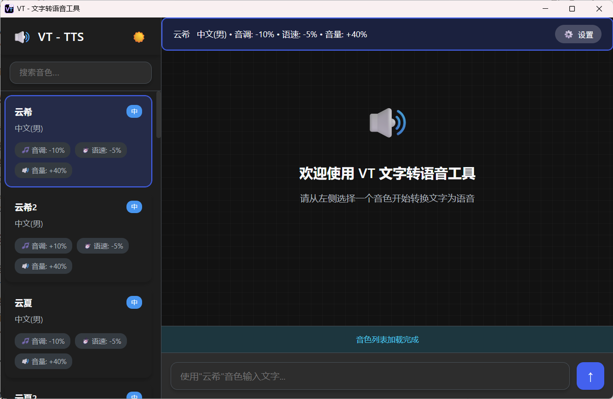

# VT 文字转语音工具


一款功能强大的文字转语音桌面应用，支持多种音色和音频合并功能。

## 功能特点

- **多音色支持**：提供多种中文语音合成音色，包括男声和女声
- **参数调节**：支持音调(pitch)、语速(rate)、音量(volume)的自定义调节
- **音频合并**：可以将多个音频文件合并为一个文件
- **批量转换**：支持批量文字转语音功能
- **暗黑模式**：支持明亮和暗黑两种界面主题，可根据个人喜好切换
- **跨平台**：基于Electron开发，支持Windows等操作系统

## 技术架构

- **框架**：Electron v36.20
- **TTS引擎**：Microsoft Edge TTS
- **音频处理**：FFmpeg
- **界面**：HTML5 + CSS3 + 原生JavaScript
- **打包工具**：electron-builder

## 安装说明

### 下载安装

1. 访问[发布页面](https://github.com/zhagons/V-tts/releases)下载最新版本
2. 运行安装程序，按照提示完成安装

### 从源码构建

```bash
# 克隆项目
git clone https://github.com/zhagons/V-tts.git

# 进入项目目录
cd vtts

# 安装依赖
npm install

# 启动开发环境
npm start

# 构建可执行文件
npm run build
```

## 使用说明

### 基本使用

1. 启动VT文字转语音工具
2. 在文本框中输入需要转换的文字
3. 选择合适的音色（可调整音调、语速、音量参数）
4. 点击"转换"按钮生成语音
5. 可以播放试听或保存音频文件

### 音频合并

1. 生成多个语音文件
2. 选择需要合并的音频文件
3. 点击"合并音频"按钮
4. 系统将自动按选择顺序合并为一个音频文件

### 主题切换

- 点击界面右上角的主题切换按钮
- 可在明亮模式和暗黑模式之间切换
- 用户偏好设置将自动保存

## 音色列表

应用内置多种中文音色：
- 云希（男声）
- 云夏（男声）
- 云扬（男声）
- 晓晓（女声）
- 云健（男声）

每种音色都可以通过参数调节实现不同的语音效果。

## 开发指南

### 项目结构

```
vtts/
├── main.mjs          # Electron主进程文件
├── preload.js        # 预加载脚本
├── index.html        # 主界面HTML
├── renderer.js       # 渲染进程逻辑（内嵌在index.html中）
├── package.json      # 项目配置文件
└── README.md         # 说明文档
```

### 主要API

- `electronAPI.textToSpeech(text, voice)` - 文字转语音
- `electronAPI.getVoices()` - 获取音色列表
- `electronAPI.mergeAudioFiles(filePaths)` - 合并音频文件
- `electronAPI.onUpdateStatus(callback)` - 监听状态更新

### 自定义音色

可以通过修改[main.mjs](file:///G:/ElectronApp/PcApp/Vtts/main.mjs)中的`ipcMain.handle('get-voices')`部分添加新的音色配置。

## 常见问题

### 音频无法播放

请确保系统已安装并启用音频播放设备。

### 转换失败

检查输入文字是否包含特殊字符，尝试简化文本内容。

### 合并功能异常

确认选择的音频文件格式一致且未被其他程序占用。

## 贡献指南

欢迎提交Issue和Pull Request来改进本项目。

## 许可证

本项目采用MIT许可证，详情请见[LICENSE](LICENSE)文件。

## 作者

zhagons

## 版本信息

当前版本：v0.0.1
